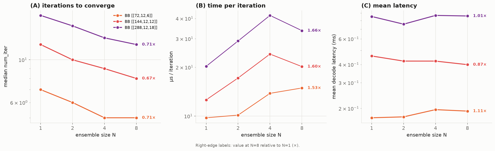
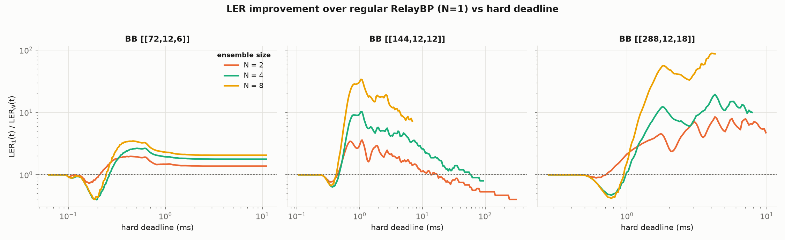
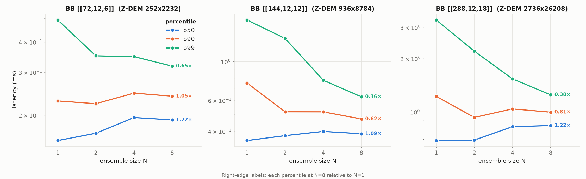
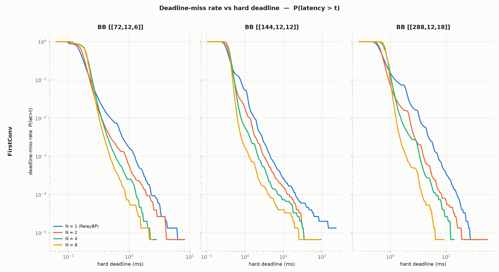

.. _ensemble_gamma_user_guide:

Gamma Ensembles for the NV-qLDPC Relay-BP Decoder
=================================================

The NV-qLDPC Relay-BP decoder supports ensembles of independent gamma distribution trajectories (N "lanes"), run in parallel on a single GPU. When any lane has satisfied the stopping criterion, then the decoder may exit early. This can lead to significantly reduced decoding times as increased parallelism allows for faster exploration of decoding solutions and therefore faster convergence.

While setting multiple lanes of ensembled gammas can reduce the number of RelayBP iterations needed to converge to a solution, it can also lead to increased time per iteration; each leg of RelayBP synchronizes between lanes to check for convergence. Multiple lanes share a fixed number of GPU blocks, so as the number of edges in the Tanner graph increases, the GPU eventually must serialize the execution of each lane at each iteration, and then block for every lane to complete. We can measure these two competing effects directly; we build the Z-component of the circuit-level detector error model (DEM) (i.e. the Z-stabilizer detectors only) for the bivariate-bicycle (BB) codes ``[[72,12,6]]``, ``[[144,12,12]]`` and ``[[288,12,18]]`` and, for each, construct the decoder with ``gamma_ensemble_size`` set to N in {1, 2, 4, 8}. We then decode many sampled syndromes, timing each ``decode()`` call and reading back the number of RelayBP iterations the decoder used to converge:

.. code-block:: python

    import cudaq_qec as qec

    # H, error_rates, syndromes come from a circuit-level DEM of the code
    decoder = qec.get_decoder(
        "nv-qldpc-decoder", H, error_rate_vec=error_rates,
        use_sparsity=True, bp_method=3, composition=1, max_iterations=50,
        gamma0=0.125, gamma_dist=[-0.24, 0.66], clip_value=200.0, repeatable=True,
        proc_float="fp32", gamma_ensemble_size=N,    # sweep N in {1, 2, 4, 8}
        srelay_config={"pre_iter": 1, "num_sets": 300,
                       "stopping_criterion": "FirstConv"},
        opt_results={"num_iter": True})              # return the iteration count

    for syndrome in syndromes:
        result = decoder.decode(syndrome)            # timed for the per-iteration cost
        num_iter = result.opt_results["num_iter"]    # RelayBP iterations to converge

All experiments below use the same circuit-level noise and decoder settings, so they can be reproduced directly. The bicycle-code DEMs use uniform circuit-level noise at ``p = 0.002`` for all three codes (with ``r = 6``, ``12`` and ``18`` rounds for ``[[72,12,6]]``, ``[[144,12,12]]`` and ``[[288,12,18]]`` respectively). The decoder is constructed as shown above with ``gamma0 = 0.125`` and ``proc_float = "fp32"`` for all codes, using ``num_sets = 300`` and ``gamma_dist = [-0.24, 0.66]`` for ``[[72,12,6]]`` and ``[[144,12,12]]``, and ``num_sets = 600`` with ``gamma_dist = [-0.161, 0.815]`` for ``[[288,12,18]]``.

As the ensemble size N grows, the median number of iterations to converge (left) falls for every code — more lanes explore more gamma sets in parallel, so the fastest-converging one wins sooner. At N = 8 the median iteration count drops to 0.67×–0.71× of its single-lane value across the three codes. The time per iteration (middle) rises with N — each lane's parity-check rows are spread over co-resident GPU blocks, so a lane must serially process more work per iteration — growing to 1.53×–1.66× at N = 8, largest for the ``[[288,12,18]]`` DEM. The net mean decode latency (right) combines the two effects; here the higher per-iteration cost roughly cancels the iteration savings, so mean latency stays close to its single-lane value at N = 8, ranging from 0.87× to 1.11×.

Ensembling also lowers the logical error rate achievable under a hard decoding deadline. Suppose each decode must finish within a wall-clock budget ``t``; a decode is a success only if it both finishes within ``t`` and returns the correct logical outcome, so the logical error rate under that deadline is ``LER(t) = P(latency > t or logical error)``. Using the same decoders as above, we record both the per-syndrome latency and whether the decoded logical is correct:

.. code-block:: python

    import time

    latencies, logical_errors = [], []
    for syndrome, truth in zip(syndromes, true_logicals):   # `decoder` as constructed above
        t0 = time.perf_counter()
        result = decoder.decode(syndrome)
        latencies.append(1e3 * (time.perf_counter() - t0))  # per-syndrome latency, ms
        logical_errors.append(logical_flips(result) != truth)

    # LER at deadline t: missed the deadline, or decoded to the wrong logical
    def ler(t):
        return np.mean([(lat > t) or err for lat, err in zip(latencies, logical_errors)])

The plot shows, for each code, the factor by which each ensemble size lowers LER relative to regular RelayBP (N = 1) as a function of the deadline ``t``; values above 1 mean a lower LER than N = 1. At the tightest deadlines the larger ensembles are briefly worse (their higher per-iteration cost delays the fastest decodes), but past that crossover a larger ensemble lowers LER substantially — by up to ~34× for ``[[144,12,12]]`` and ~89× for ``[[288,12,18]]`` near their knees. For those two codes the multiplier then falls back toward 1× at loose deadlines, where both the ensemble and N = 1 reach their near-zero logical error floors; for ``[[72,12,6]]`` it settles at ~2×, the ratio of the logical error floors.

The worst-case (i.e. p99) latency improves with N for every code — at N = 8 it improves by ~1.55× for ``[[72,12,6]]``, ~2.75× for ``[[144,12,12]]`` and ~2.65× for ``[[288,12,18]]``. The median (p50) rises with N (by ~1.09×–1.22× at N = 8), as the per-iteration overhead is paid on decodes that would have converged quickly anyway. Ignoring logical errors, the same hard deadline defines the deadline-miss rate — the fraction of decodes not converged within the budget ``t``. The plot below shows this rate versus deadline for regular RelayBP (N = 1) and for each ensemble size N; each curve is measured over 150,000 sampled syndromes per configuration at the circuit-level noise strength given above (``p = 0.002``) with ``max_iterations = 50`` (and ``num_sets = 300`` for ``[[72,12,6]]`` and ``[[144,12,12]]``, ``600`` for ``[[288,12,18]]``), using the ``FirstConv`` stopping criterion.

Ensembling contracts the latency tail for all three codes: beyond a crossover at the tightest deadlines (where the higher per-iteration cost makes the larger ensembles slightly worse), a larger ensemble misses fewer deadlines at looser budgets and reaches a lower floor.
